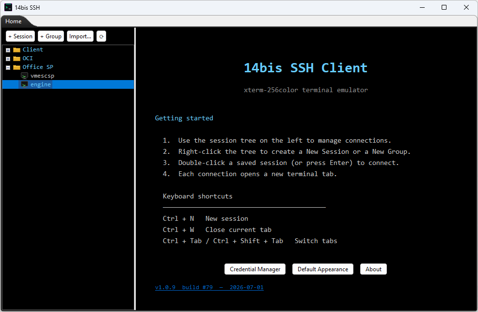
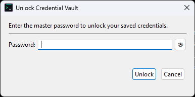
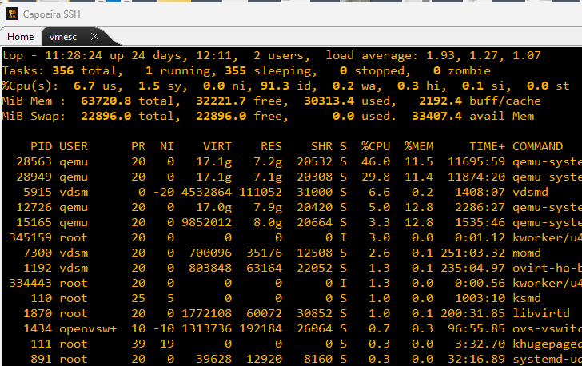
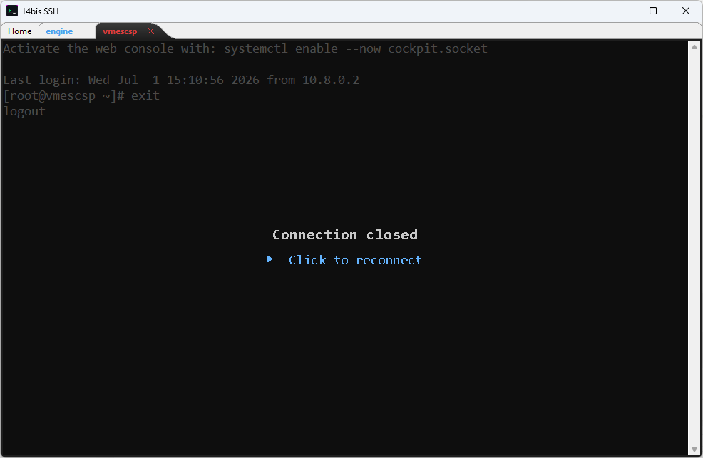

# Capoeira SSH

A lightweight SSH terminal client with a built-in xterm-256color emulator, built with Java and SWT.



<details>
<summary>More screenshots</summary>

| | |
|---|---|
|  Home tab |  Credential vault unlock |
|  An active terminal session |  Disconnected session (red tab) |

</details>

## Features

- **xterm-256color** terminal emulator with full colour, bold, underline and reverse support
- **Tabbed interface** — open multiple sessions side by side, drag tabs to reorder
- **Session manager** — save hosts, port, authentication method and terminal appearance per session
- **Session icons** — pick one of 36 bundled icons to tell sessions apart at a glance
- **List or Card view** — browse "All sessions" as a flat list or as Windows-Start-Menu-style
  group cards; drag a session between group cards to move it; your choice persists across restarts
- **Authentication** — username/password, private key, or saved credentials (AES-256 encrypted vault)
- **Credential manager** — store and reuse credentials across sessions, protected by a master password
- **Session groups** — organise sessions into named groups
- **Encrypted backup** — export all sessions (and, optionally, the credential vault) to a single
  password-protected file, and import it back or merge it into another install
- **Terminal appearance** — per-session font size, foreground and background colour
- **Screen capture / logging** — save terminal output (plain text, ANSI stripped) to a file; toggle on/off at any time from the tab context menu
- **Scrollback buffer** with mouse wheel and scroll bar
- **Text selection** and copy with mouse; paste with right-click (multiline paste confirmation)
- **Activity indicator** — background tabs with incoming data blink bold blue; disconnected sessions turn bold red

## Requirements

| Component | Minimum |
|-----------|---------|
| Java | 21 or newer |
| OS | Windows 10+, Linux (GTK 3), macOS 11+ |

## Installation

### From a release binary (recommended)

1. Download the installer for your platform from the [Releases](../../releases) page.
2. Run the installer — Java is bundled, no separate installation required.

### From source

```bash
git clone https://github.com/vchaves123/capoeira-ssh.git
cd capoeira-ssh
mvn package
java -jar target/capoeira-ssh-*.jar
```

Maven and Java 21+ must be installed.

## Data storage

All application data is stored under `~/.capoeira/`:

```
~/.capoeira/
├── sessions/          # saved session files
├── screen_captures/   # terminal text captures (when logging is enabled)
└── log/               # application log (app.log)
```

## Usage

### Creating a session

1. Click **New Session** (or press `Ctrl+N`).
2. Fill in host, port, authentication and optionally a terminal appearance.
3. Click **Save** — the session appears in the tree on the left.
4. Double-click the session (or press Enter) to connect.

### Logging terminal output

Logging can be configured per session in **Edit Session → Log output**, or toggled at any time by right-clicking the session tab and choosing **Start Logging** / **Stop Logging**.  
Log files are saved as `yyyyMMdd_HHmmss_<name>.log` under the configured directory.

### Keyboard shortcuts

| Shortcut | Action |
|----------|--------|
| `Ctrl+N` | New session |
| `Ctrl+W` | Close current tab |
| `Ctrl+Tab` | Next tab |
| `Ctrl+Shift+Tab` | Previous tab |

## Code signing

The Windows installer is not yet code-signed. See [SIGNING.md](SIGNING.md) for details
and options.

## Credits

Third-party inspirations and attributions are listed in [CREDITS.md](CREDITS.md).

## License

Copyright (C) 2026 Vicente Melo — Molho Ltda.

This program is free software: you can redistribute it and/or modify it under the terms of the
**GNU General Public License version 3** as published by the Free Software Foundation.

See [LICENSE](LICENSE) for the full text.
